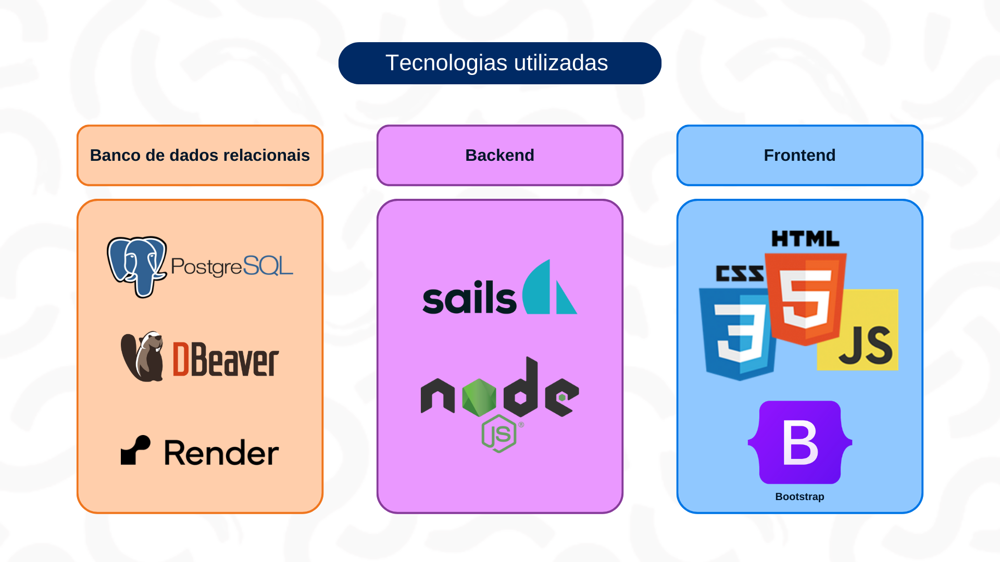

# Arquitetura MVC do Oportoniza

- Nome do Projeto: <a href= 'https://github.com/Inteli-College/2024-1B-T11-IN02-G01'>[Oportoniza]</a>
- Descrição: O Oportoniza, da equipe Tripulação Voluntária (G01), é uma plataforma web que visa exibir oportunidades de voluntariado e promover a cultura solidária, de forma a atribuir significado e relevância às posições voluntárias no Brasil. A arquitetura MVC do projeto foi desenvolvida pela equipe, de forma coletiva, visando esclarecer os principais comportamentos do usuário na plataforma e como que eles seriam transpassados para o código para desenvolvimento da aplicação web.
- Arquitetura: MVC (Model-View-Controller)
- Ferramenta de Diagramação: A ferramenta de diagramação utilizada pelo projeto foi o <a href = 'https://www.canva.com/'>canva</a>. O grupo todo desenvolveu através da plataforma, para não só expôr o fluxo MVC, mas também personalizá-lo conforme a identidade visual do projeto.
  

Figura 1 - Arquitetura MVC do Oportoniza

Fonte: Material produzido pelo autor (2024)

### Modelos (Models):

- User: Armazena informações detalhadas dos usuários, como nome, gênero, localização e até mesmo as roupas desbloqueadas para o carangueijo. Este modelo proporciona uma base completa para o perfil do usuário, facilitando a personalização da experiência.
- Post: Serve como o banco de dados para postagens, o modelo Post inclui campos para título, conteúdo, anexos e um ID de usuário para identificação. Isso permite que os usuários compartilhem conteúdo rico e relevante dentro da plataforma, enriquecendo a interação entre os membros.
- Preferences: Armazena suas preferências de trabalho, como descrição, interesses e carga horária. Com o UserId como chave estrangeira, o modelo Preferences ajuda a vincular essas preferências aos perfis individuais dos usuários.
  
Controladores (Controllers):

- Login do Usuário:
Cadastrar: Registra novos usuários, coletando informações como nome, gênero, localização, senha e email, enquanto gera automaticamente um ID único para cada usuário, garantindo uma identificação exclusiva.
Verificar: Valida a autenticidade dos usuários através do email e senha fornecidos, retornando o ID do usuário e confirmando o sucesso do login, garantindo a segurança e acesso adequado à plataforma.
Apresentar: Garante a privacidade, apresentando as informações do usuário, retornando todas as informações relevantes, exceto a senha, mantendo a confidencialidade dos dados dos usuários.

- Publicações:
Criar: Permite que os usuários criem novas postagens, fornecendo título, conteúdo, anexos e o ID do usuário como referência, enquanto gera automaticamente um ID único para cada postagem, facilitando a organização e recuperação de conteúdo.
Apresentar: Utiliza o ID da postagem e recupera e exibe detalhes como título, conteúdo, anexos e o ID do usuário relacionado, permitindo que os usuários visualizem e interajam com o conteúdo compartilhado.

- Perfis:
Atualizar: Atualiza as informações de preferência com base nas entradas fornecidas pelo usuário, este controlador garante que as preferências dos voluntários sejam atualizadas de forma precisa e eficiente, refletindo suas escolhas e interesses atuais.
Apresentar: Exibe as informações de preferência, este controlador fornece uma visão clara das preferências de trabalho dos voluntários, útil tanto para os próprios voluntários quanto para aqueles que procuram perfis de voluntários adequados para projetos específicos.

### Visões (Views):

- Conta: Serve como o menu principal para os usuários, fornecendo acesso fácil às funcionalidades principais da plataforma. Se um usuário não estiver cadastrado, esta visão exibirá a tela de login, enquanto para usuários cadastrados, apresentará informações da conta conforme necessário, proporcionando uma experiência de usuário consistente e intuitiva.

- Publicações: Permite aos usuários visualizar publicações dentro da plataforma, apresentando o conteúdo de forma clara e acessível, conforme fornecido pelo controlador de Publicações. Isso promove a interação e o engajamento dos usuários com o conteúdo compartilhado.
  
- Perfil: Oferece uma visualização personalizada das informações do usuário, incluindo suas preferências de trabalho, com a opção de alterar essas informações se o perfil visualizado pertencer ao próprio usuário logado. Isso permite uma gestão eficiente e personalizada do perfil do usuário, promovendo uma experiência de usuário ainda mais adaptada e satisfatória.

 
&nbsp;&nbsp;&nbsp;&nbsp;Assim, como exposto pela apresentação das três repartições da estruturação MVC, percebe-se como ele é extremamente útil no contexto de divisão e categorização de processos.

### Infraestrutura:

Figura 2 - Tecnologias utilizadas no projeto

Fonte: Material produzido pelo autor (2024)

&nbsp;&nbsp;&nbsp;&nbsp;Os componentes de infraestrutura do projeto se baseiam nas ferramentas que proporcionam o banco de dados relacionais: PostgreSQL, DBeaver e Render. Mas, ainda, é importante ressaltar os meios que possibilitam a integração desse banco de dados e a exibição da interface, que consistem nas linguagens de programação: Sails e Node.js (Back-end), CSS, HTML, Javascript e Bootstrap (Front-end).

&nbsp;&nbsp;&nbsp;&nbsp;Esses elementos estão intimamente alinhados com a arquitetura MVC (Model-View-Controller). O PostgreSQL atua como a base de dados do modelo, armazenando informações essenciais, enquanto o DBeaver facilita a administração e manipulação desses dados. O Render entra nessa sendo empregado para gerar uma exibição eficaz e amigável dos dados. Por outro lado, as linguagens de programação e frameworks do front-end, como HTML, CSS, JavaScript e Bootstrap, formam a camada de visão, proporcionando interfaces interativas e responsivas para os usuários. Enquanto isso, Sails e Node.js gerenciam o fluxo de dados e a lógica de negócios no back-end, atuando como controladores que conectam o modelo e a visão, o que garante uma interação suave e eficiente entre os componentes do sistema. 

&nbsp;&nbsp;&nbsp;&nbsp;A abordagem utilizada pelo projeto Oportoniza segue os princípios da arquitetura MVC, fornecendo uma estrutura organizada e modular para o desenvolvimento de aplicativos escaláveis e de fácil manutenção.

### Justifique as escolhas feitas e como elas impactam o projeto.
#### Implicações da Arquitetura:
&nbsp;&nbsp;&nbsp;&nbsp;O MVC oferece diversos benefícios, incluindo clara separação de responsabilidades, facilitando manutenção e extensão do código, e promovendo a reutilização de componentes. Além disso, facilita a colaboração entre equipes, permitindo que diferentes membros trabalhem em partes distintas da aplicação sem interferências. Dessa forma, a utilização desse modelo no projeto facilita a integração da equipe e o desenvolvimento coletivo das funcionalidades a serem atribuídas na plataforma.
